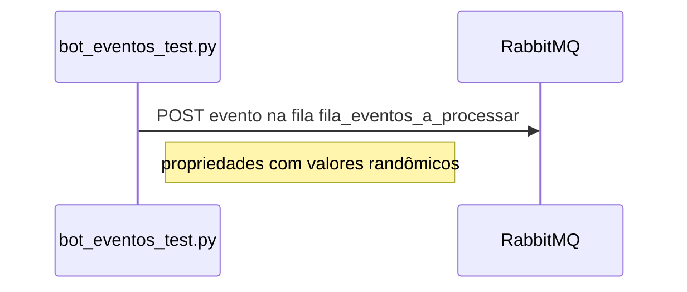
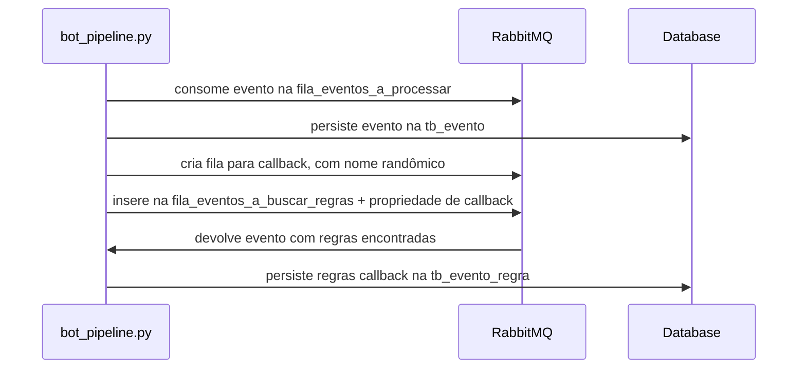
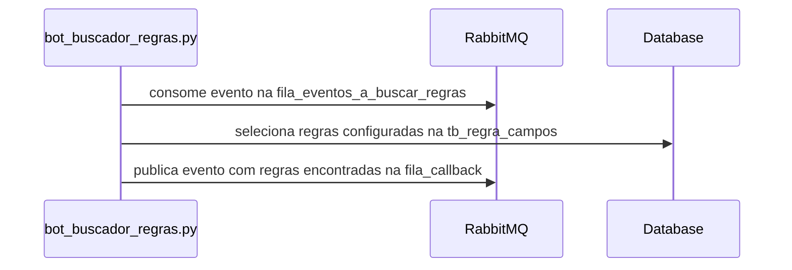
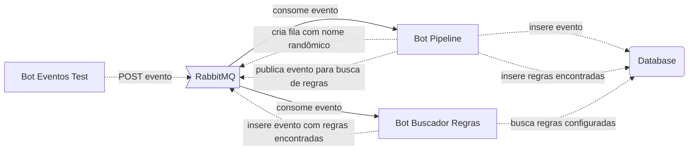

# Processamento de Eventos RPC  

  
Desenvolvidos bots com o intuito de efetuar testes de processamento RPC
  
## Bots
- bot_eventos_test.py  
    Efetua a ingestão continua de eventos randômicos;  
- bot_pipeline.py  
    Controla o pipeline RPC;  
- bot_buscador_regras.py  
    Busca e popula as regras relacionadas;  
  
  
## Configuração
- Script de criação: mysql_script.sql  
- Script inicial de configuração: mysql_init_config.sql  
  

## Diagramas

### Bot Eventos Test

### Bot Pipeline

  
### Bot Buscador Regras

### Fluxo Completo

  
## Releases Futuros  
- Refatoração em classes; 
- Utilização de pattern;  

> Escrito com [StackEdit](https://stackedit.io/).